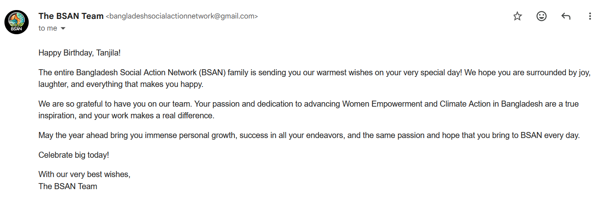
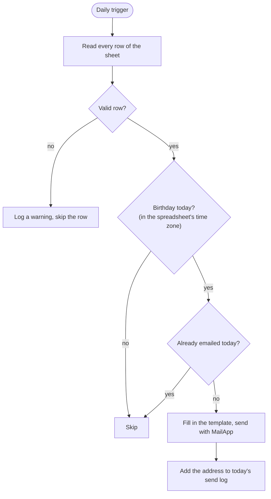

# Birthday Wishes Automator

[](https://github.com/sandipkumarpaul/birthday-wishes-automator/actions/workflows/ci.yml)
[](LICENSE)
[](https://developers.google.com/apps-script)

A Google Apps Script that reads a Google Sheet of names, email addresses and birthdays, and emails a personalized greeting to everyone whose birthday is today. It runs on Google's servers on a daily trigger, so once it is set up there is nothing to host and nothing to remember.

We built it for the volunteer team at the Bangladesh Social Action Network (BSAN), so that nobody's birthday goes unnoticed. Here is a real email it sent:



<sub>The message is BSAN's customized version of the default template. The date is hidden for privacy.</sub>

---

## Features

- **Runs by itself.** A daily time-driven trigger checks the sheet and sends the emails.
- **Personal emails.** `{name}` and `{firstName}` placeholders work in both the subject and the HTML body.
- **Forgiving sheet format.** Columns are found by their header, so they can be in any order and extra columns are ignored. Birthdays can be real date cells or text (`MM/DD/YYYY`, `MM/DD`, `YYYY-MM-DD`), and the birth year is optional.
- **Safe to re-run.** A per-day send log means running the script by hand on top of the trigger never emails anyone twice.
- **Clear failures.** Bad rows are logged and skipped. If an email can't be sent, the others still go out, and the run ends with an error so Google emails you a failure notice.
- **Minimal permissions.** The script can only send email and access the one spreadsheet it is attached to. It cannot read your inbox or your other files.
- **Tested.** A Node.js test suite runs the script against mocked Apps Script services on every push.
- **Free.** Uses only Google Sheets and Apps Script, which are free with a Google account.

## How it works



## Sheet format

Create a tab named `Volunteers` with these headers in row 1:

| FullName     | Email             | DOB        |
| ------------ | ----------------- | ---------- |
| Maya Rahman  | maya@example.com  | 09/23/1998 |
| Leo Martins  | leo@example.com   | 06/23      |
| Nadia Islam  | nadia@example.com | 2001-12-05 |

Header matching ignores case. To use different header names or a different tab name, change `COLUMNS` and `SHEET_NAME` in the script's configuration.

## Setup

### Option A: copy and paste (about 5 minutes)

1. **Create the sheet** as described above.
2. **Add the script.** In the sheet, open `Extensions` > `Apps Script`. Replace the contents of `Code.gs` with [`src/BirthdayWisher.gs`](src/BirthdayWisher.gs) and save.
3. **Customize it.** Edit the `CONFIG` block at the top of the script: sender name, subject and email body.
4. **Send yourself a preview.** Choose `sendTestEmail` in the function dropdown in the toolbar and click **Run**. Google will ask you to authorize the script the first time. Check your inbox for the test email.
5. **Turn it on.** Choose `installDailyTrigger` and click **Run**. The script will now run every day between 8 and 9 AM. Change `TRIGGER_HOUR` to pick a different hour.

> **Tip:** To check your sheet without emailing anyone, set `DRY_RUN: true`, run `sendBirthdayWishes`, and open the execution log. It lists who would get an email today and any rows it couldn't read.

Birthdays are matched in the spreadsheet's time zone. You can check or change it under `File` > `Settings` in the sheet.

### Option B: deploy with clasp

[clasp](https://github.com/google/clasp) is Google's command-line tool for Apps Script. It lets you keep the code in this repo and push it to your project.

1. Complete step 1 above, then open `Extensions` > `Apps Script` once to create the script project. Copy the **Script ID** from `Project Settings`.
2. Enable the Apps Script API at <https://script.google.com/home/usersettings>.
3. Install clasp, log in, and link this folder to your project:

   ```bash
   npm install -g @google/clasp
   clasp login
   echo '{ "scriptId": "YOUR_SCRIPT_ID", "rootDir": "src" }' > .clasp.json
   clasp push
   ```

4. Continue from step 3 of Option A.

`clasp push` replaces all the code in the project, including the manifest (`appsscript.json`), with the files in `src/`.

## Configuration

All settings live in the `CONFIG` object at the top of [`src/BirthdayWisher.gs`](src/BirthdayWisher.gs).

| Setting                    | Default                        | What it does                                                         |
| -------------------------- | ------------------------------ | -------------------------------------------------------------------- |
| `SHEET_NAME`               | `"Volunteers"`                 | The tab to read.                                                     |
| `COLUMNS`                  | `FullName`, `Email`, `DOB`     | The header text of the name, email and date-of-birth columns.       |
| `EMAIL_SENDER_NAME`        | `"Your Team Name"`             | The sender name recipients see.                                      |
| `BIRTHDAY_EMAIL_SUBJECT`   | `"Happy Birthday, {firstName}! 🎉"` | Subject line. Supports `{name}` and `{firstName}`.            |
| `BIRTHDAY_EMAIL_BODY_HTML` | A short birthday message       | HTML body. Supports the same placeholders, which are HTML-escaped.  |
| `TRIGGER_HOUR`             | `8`                            | Hour (0–23) that `installDailyTrigger` schedules the daily run for. |
| `DRY_RUN`                  | `false`                        | When `true`, logs who would get an email but sends nothing.         |

## Running the tests

The tests need [Node.js](https://nodejs.org/) 22 or later. There are no packages to install.

```bash
npm test
```

The test file loads `src/BirthdayWisher.gs` unmodified into a Node [`vm`](https://nodejs.org/api/vm.html) sandbox, with small fakes for `SpreadsheetApp`, `MailApp`, `PropertiesService`, `ScriptApp`, `Session` and `Utilities`. Each test sets up a sheet and a fixed "today", runs the script, and checks which emails were sent. The cases cover date parsing, time zones, leap-day birthdays, duplicate prevention, dry runs, bad rows and failed sends.

## Project structure

```
.
├── src/
│   ├── BirthdayWisher.gs        # The script
│   └── appsscript.json          # Apps Script manifest: V8 runtime and permissions
├── tests/
│   └── birthdayWisher.test.js   # Node.js tests with mocked Apps Script services
├── docs/images/                 # Screenshots used in this README
├── .github/workflows/ci.yml     # Runs the tests on every push and pull request
└── package.json                 # Defines `npm test`; no dependencies
```

## Design notes

- **Time zones.** Apps Script can run in a different time zone than the spreadsheet. If a DOB cell (midnight in the sheet's zone) is read in the script's zone, the birthday can land on the wrong day. The script reads both "today" and every DOB cell in the spreadsheet's time zone with `Utilities.formatDate`, and a test pins this behavior with a non-UTC zone.
- **Idempotency.** Each run records who it emailed in a small per-day log in Script Properties. That makes it safe to run the script manually on a day the trigger has already run. A failed send isn't logged, so the next run retries it.
- **Least privilege.** The first version used `GmailApp`, which asks for permission to *read, send and delete all of your email*. `MailApp` only needs permission to send. `@OnlyCurrentDoc` and the scopes in `appsscript.json` limit spreadsheet access to the sheet the script is attached to.
- **Leap-day birthdays.** People born on February 29 get their email on February 28 in non-leap years instead of never.
- **Testable core.** `sendBirthdayWishes()` is a one-line wrapper around `runBirthdayCheck_(now)`. Passing the date in lets the tests run the real logic for any day of the year.

## Limitations

- **Email quota.** Apps Script can send email to 100 recipients a day from a personal Google account and 1,500 from a Google Workspace account ([quotas](https://developers.google.com/apps-script/guides/services/quotas)). The script checks the remaining quota before each send.
- **Run time.** Time-driven triggers run at some point during the chosen hour, not at an exact minute.
- **Sender.** Emails are sent from the Google account that installed the trigger.

---

## Authors & Acknowledgements

This project was co-developed by:

*   **Sandip Kumar Paul** - [sandipkumarpaul](https://github.com/sandipkumarpaul)
*   **Tanjila Afsari Rubina** - [tanjilaafsarirubina](https://github.com/tanjilaafsarirubina)

This was a joint effort in conceptualizing, developing, and refining the automation script. This project was a fun learning experience in Google Apps Script!

## License

Released under the [MIT License](LICENSE).
